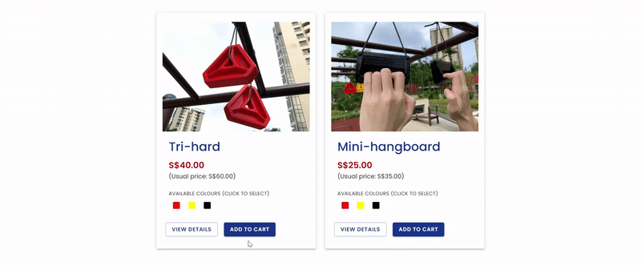

# SUPERCRIMP E-Commerce Platform

<picture>
  <source media="(prefers-color-scheme: dark)" srcset="./public/readme/logo-white.png">
  <source media="(prefers-color-scheme: light)" srcset="./public/readme/logo-black.png">
  
</picture>

SUPERCRIMP is an existing, small, local business that sells 3D-printed crimp holds for rock-climbing enthusiasts.

At the time of starting this project, the business hadn’t been able to find an appropriate website to host its online store, with some e-commerce platforms falling short of features and others being too complicated or expensive for a simple business.

Thus, the goal of this project was to build a customised online store that meets the needs of SUPERCRIMP’s stakeholders:

**For customers**

- It must be convenient to browse and make purchases.
- They must be able to pay securely online.

**For the business owner**

- It must be easy to view order details and mark them as complete.
- It must be easy to add, update and delete product listings.

## Website

Coming soon

## Features

<!-- To be fleshed out with screenshots later -->

### Browsing product catalogue

1. On the home page, customers can see the list of available products.

   > A scrolling banner gives information about the company and products.
   > 

   > Available products are listed below the banner.
   > 

2. Customers can click on each item to view more details on the ℹ️ **Product page**.

   > Ways to navigate to the Product Listing page. Customers can click on the Image, Product Name or View Details button on the Product cards.
   > 

   > This is what the Product Listing page looks like.
   > 

3. Customers can choose to 🛒 **Add to cart** from either view.
   > There is snackbar feedback for user actions (bottom left corner).
   > 

### Making a purchase

1. Customers can confirm their chosen products (including colour and quantity) on the 🛒 **Cart** page. They can click **Continue shopping**, which brings them back to the product catalogue, or **Proceed to checkout**.

   > They can also edit the items in their cart.
   > 

   > Clicking "Proceed to Checkout" will bring them to the 💳 **Checkout** page.
   > 

2. At the 💳 **Checkout** page, customers have to enter their name, email, mobile number, and shipping address. At the bottom, they will be able to see a summary of their order. Clicking "Proceed to Payment Gateway" will redirect them to Stripe to make payment.

   > Customers need to fill out all details before proceeding to make payment via Stripe.
   > 

3. Upon successful payment, customers are brought back to the SUPERCRIMP website, and an email with their order details is sent to their email address.

   > Customers have to provide Stripe with their email address and credit card details. A summary of items in their order is shown on the left of the screen.
   > 

   > Customers are sent an order confirmation email.
   > 

### Admin

**Receiving New Orders**

- Upon successful payment for a new order, Admin will receive an email notification with the order details.

**Viewing and Marking Orders as Complete**

1. Upon login, admin can see an overview of all Orders (incomplete and complete).
2. Each order contains the following details:
   - Items (Product, Quantity of product, Colour)
   - Total amount
   - Customer's name
   - Customer's email
   - Customer's mobile number
   - Shipping address
3. Admin is able to mark an order as complete once the items have been sent out.

**Adding, Updating and Deleting Products and Colours**

_Products refer to the different 3D-printed designs. Colours refer to the 3D-printing material._

1. There are overview pages for Products and Colours, where the Admin can view all Products / Colours, as well as delete any unwanted ones.
2. Admin is able to add a new product, or edit an existing one, with the following details:
   - Product name
   - Product description
   - Colours
   - Usual price
   - Current price (for discounts)
   - Availability
3. Admin is able to add and edit colours with the following details:
   - Colour name
   - Colour hex code
   - Availability

## Built With

|               | Tech                | Purpose           |
| ------------- | ------------------- | ----------------- |
| Frontend      | **React**           | User interface    |
|               | **React Router**    | Component routing |
|               | **Material UI**     | Component library |
| Backend       | **Node.js**         | Server            |
|               | **Express**         | Server            |
|               | **PostgreSQL**      | Database          |
|               | **Sequelize**       | Database          |
| Functionality | **Stripe**          | Payment           |
|               | **JWT**             | Authentication    |
|               | **Twilio SendGrid** | Email updates     |

## Contributors

**Elizabeth Tan** | [GitHub](https://github.com/liztanyl/) • [LinkedIn](https://www.linkedin.com/in/elizabethtanyulin/) • [Email](elizabeth.tanyulin@gmail.com)

**Gerald Khor** | [GitHub](https://github.com/gcskhor/) • [LinkedIn](https://www.linkedin.com/in/gerald-khor/) • [Email](elizabeth.tanyulin@gmail.com)
